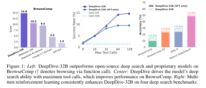
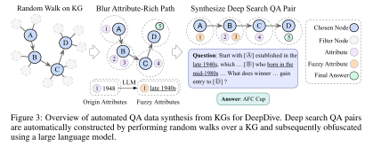
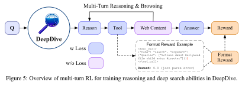
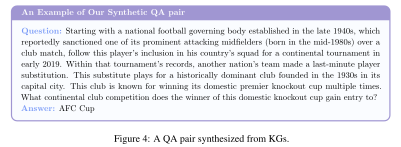
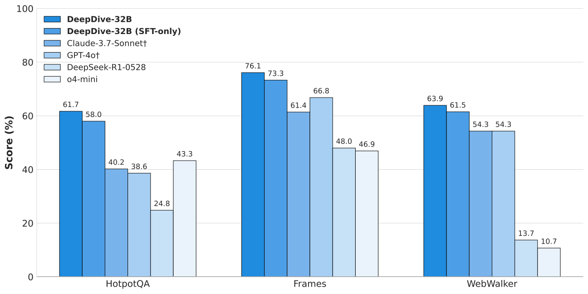
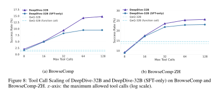
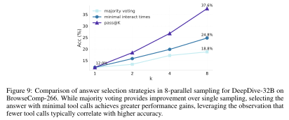

# DeepDive: Advancing Deep Search Agents with Knowledge Graphs and Multi-Turn RL

<div align="center">

[](https://github.com/THUDM/DeepDive)
[](https://arxiv.org/pdf/2509.10446)
[](https://huggingface.co/datasets/zai-org/DeepDive)
[](#)

</div>

<div align="center">
  
  <p><em> </em></p>
</div>

## 🔥 News

- **[2025/10/02]** Released the complete [data construction pipeline](./qa_synthetic) — now fully available in the repository.
- **[2025/09/17]** QA pairs and SFT trajectories have been fully open-sourced, totaling 4,108 entries. Check them out on [Hugging Face Dataset DeepDive](https://huggingface.co/datasets/zai-org/DeepDive).
- Model and code are currently under development – coming soon!

## Overview

**DeepDive** presents an automated approach for training deep search agents that can navigate complex, multi-step information-seeking tasks. Our method combines automated data synthesis from knowledge graphs with end-to-end multi-turn reinforcement learning to create agents capable of sophisticated long-horizon reasoning and web browsing.

### **Key Features**

- **Automated Deep Search Data Synthesis**: Generate challenging QA pairs from knowledge graphs through controlled random walks
- **Multi-Turn RL Training for Browsing**: End-to-end reinforcement learning for deep search capabilities
- **Test-Time Scaling**: Supports scaling via tool calls and parallel sampling

## **Method Overview**

### **Stage 1: Automated Data Synthesis from Knowledge Graphs**

<div align="center">

<p><em></em></p>
</div>

We propose an automated method to synthesize complex, difficult, and hard-to-find questions from open knowledge graphs. The process involves three key steps:

**Knowledge Graph Random Walks**: Starting from an initial node $v_0$, we navigate through the graph for $k$ steps to form a path $P=[v_0, v_1, \ldots, v_k]$, where each step $(v_i, v_{i+1})$ is a valid edge in the graph. We choose longer path lengths ($k > 5$) to increase reasoning complexity.

**Entity Obfuscation**: We combine each node $v_i$ in the path with its corresponding attributes to form an attribute-rich path:

$$P_A = [(v_0, [a_0^0, a_0^1, \ldots]), (v_1, [a_1^0, a_1^1, \ldots]), \ldots, (v_k, [a_k^0, a_k^1, \ldots])]$$

An LLM then obfuscates information along the entire path, generalizing specific details and creating "blurry entities" that require deep search to resolve.

**Difficulty Filtering**: We use a frontier model (GPT-4o) with basic search to attempt each question four times. Only questions that the frontier model fails in all attempts are retained, ensuring high difficulty.

### **Stage 2: End-to-End Multi-Turn Reinforcement Learning**

<div align="center">

<p><em></em></p>
</div>

We apply end-to-end multi-turn RL to enhance the agent's long-horizon reasoning and browsing capabilities. The training process follows an iterative cycle where at step $t$, the agent generates chain-of-thought $c_t$, executes browsing action $a_t$, and observes web content $o_t$.

**Multi-Turn GRPO Training**: We employ Group Relative Policy Optimization with normalized advantages:

$$
A_i = \frac{r_i - \text{mean}(\{r_k\}_{k=1}^G)}{\text{std}(\{r_k\}_{k=1}^G)}
$$

**Strict Binary Rewards**: A trajectory receives reward +1 if and only if both format correctness and answer accuracy are satisfied:

$$
r(\mathcal{T}) = \begin{cases} 1, & (\forall i, \text{Format}(c_i, a_i)) \wedge \text{Judge}(a_{\text{eos}}, a^*) \\ 0, & \text{otherwise} \end{cases}
$$

This strict reward mechanism ensures high-quality trajectories and prevents reward hacking.

## Models

| Model            | Parameters | HuggingFace Hub | Performance (BrowseComp) |
| ---------------- | ---------- | --------------- | ------------------------ |
| **DeepDive-9B**  | 9B         | coming soon     | 6.3%                     |
| **DeepDive-32B** | 32B        | coming soon     | **14.8%**                |

## Data

**Synthetic Dataset Construction**

Our automated data synthesis pipeline creates challenging QA pairs through knowledge graph random walks, entity obfuscation, and difficulty filtering. The process uses multi-hop paths (k=5-9) through KILT and AMiner knowledge graphs.

| Component            | Size  | Explanation                                              |
| :------------------- | :---- | :------------------------------------------------------- |
| Total Dataset        | 3,250 | All QA pairs in the training corpus                      |
| SFT Portion          | 1,016 | Subset of the data used for Supervised Fine-Tuning (SFT) |
|   ↳ SFT Trajectories | 858   | Search Traces from the SFT QA pairs via reject sampling  |
| RL Portion           | 2,234 | Subset of the data used for Reinforcement Learning (RL)  |

**Data Example**

<div align="center">

<p><em> </em></p>
</div>

## Results

**Main Results**

We evaluate DeepDive on four challenging deep search benchmarks: BrowseComp, BrowseComp-ZH, Xbench-DeepSearch, and SEAL-0. The results demonstrate consistent improvements over existing open-source models.

| Model                          | Reason | Browse | BrowseComp | BrowseComp-ZH | Xbench-DeepSearch | SEAL-0   |
| ------------------------------ | ------ | ------ | ---------- | ------------- | ----------------- | -------- |
| **Proprietary Models**         |        |        |            |               |                   |          |
| GPT-4o                         | ✗      | ✗      | 0.9\*      | 11.1          | 18.0\*            | 0.9      |
| GPT-4o†                        | ✗      | ✓      | 1.9\*      | 12.8          | 30.0              | 9.1      |
| Claude-3.7-Sonnet              | ✗      | ✗      | 2.3        | 11.8          | 12.0              | 2.7      |
| Claude-3.7-Sonnet†             | ✗      | ✓      | 4.5        | 14.2          | 29.0              | 14.4     |
| o1                             | ✓      | ✗      | _9.9\*_    | _29.1\*_      | 38.0              | 11.7     |
| o4-mini                        | ✓      | ✗      | 6.1\*      | 15.2\*        | 22.3\*            | 2.7      |
| Claude-4-Sonnet-Thinking       | ✓      | ✓      | 2.6        | 21.5          | 27.0              | 9.0      |
| Claude-4-Sonnet-Thinking†      | ✓      | ✗      | 14.7       | 30.8          | 53.0              | 37.8     |
| Grok-DeepResearch              | ✓      | ✓      | -          | 12.9\*        | _50+_             | -        |
| Doubao-DeepThink               | ✓      | ✓      | -          | 26.0\*        | _50+_             | -        |
| DeepResearch                   | ✓      | ✓      | **51.5\*** | **42.9\***    | -                 | -        |
| **Open-Source Models**         |        |        |            |               |                   |          |
| GLM-Z1-9B-0414                 | ✗      | ✗      | 0.6        | 2.4           | 8.0               | 7.2      |
| GLM-Z1-9B-0414†                | ✗      | ✓      | 0.6        | 1.7           | 3.0               | 2.7      |
| Qwen2.5-32B-Instruct           | ✗      | ✗      | 0.6        | 9.3           | 8.7\*             | 2.7      |
| Qwen2.5-32B-Instruct†          | ✗      | ✓      | 1.5        | 1.7           | 12.0              | 0.9      |
| Qwen3-235B-A22B-Instruct-2507  | ✗      | ✗      | 0.9        | 17.6          | 17.0              | 6.3      |
| Qwen3-235B-A22B-Instruct-2507† | ✗      | ✓      | 0.9        | 14.9          | 26.0              | 9.1      |
| Qwen3-235B-A22B-Thinking-2507  | ✗      | ✗      | 3.1        | 20.1          | 22.0              | 9.0      |
| Qwen3-235B-A22B-Thinking-2507† | ✗      | ✓      | 4.6        | 22.5          | 37.0              | 13.5     |
| QwQ-32B                        | ✓      | ✗      | 1.7        | 13.5          | 10.7\*            | 5.4      |
| QwQ-32B†                       | ✓      | ✓      | 1.3        | 14.5          | 27.0              | 4.5      |
| DeepSeek-V3-0324               | ✗      | ✗      | 1.5        | 24.6          | 36.0              | 6.3      |
| DeepSeek-R1                    | ✓      | ✗      | 2.0        | 23.2          | 32.7\*            | 5.4      |
| DeepSeek-R1-0528               | ✓      | ✗      | 3.2        | 28.7          | 37.0              | 5.4      |
| GLM-4.5-Air                    | ✓      | ✓      | 21.3       | 36.3          | 65.0              | 30.6     |
| GLM-4.5                        | ✓      | ✓      | 26.4       | 37.5          | 68.0              | 36.0     |
| **Web Agents**                 |        |        |            |               |                   |          |
| Search-o1-32B                  | ✓      | ✓      | 2.8\*      | 17.9\*        | 25.0\*            | -        |
| WebThinker-32B                 | ✓      | ✓      | 2.8\*      | 7.3\*         | 24.0\*            | -        |
| WebDancer-32B                  | ✓      | ✓      | 3.8\*      | 18.0\*        | 39.0\*            | -        |
| WebSailor-7B                   | ✓      | ✓      | 6.7\*      | 14.2\*        | 34.3\*            | -        |
| WebSailor-32B                  | ✓      | ✓      | 10.5\*     | 25.5\*        | 53.3\*            | -        |
| **DeepDive (Ours)**            |        |        |            |               |                   |          |
| DeepDive-9B (sft-only)         | ✓      | ✓      | 5.6        | 15.7          | 35.0              | 15.3     |
| DeepDive-9B                    | ✓      | ✓      | 6.3        | 15.1          | 38.0              | 12.2     |
| DeepDive-32B (sft-only)        | ✓      | ✓      | 9.5        | 23.0          | 48.5              | 23.9     |
| **DeepDive-32B**               | ✓      | ✓      | **14.8**   | **25.6**      | **50.5**          | **29.3** |

> [!NOTE]
> `*` represents reported performance from existing studies. `†` represents equipping browsing via function call.

**Generalization on Simple Search Tasks**

We evaluate DeepDive not only on challenging search tasks (e.g., BrowseComp, BrowseComp-ZH) but also on simpler benchmarks such as HotpotQA, Frames, and WebWalker.
DeepDive-32B (SFT and RL) consistently outperforms strong baselines, achieving >60 points on WebWalker, surpassing WebShaper-72B (52.2).
These results demonstrate DeepDive’s strong and generalizable search capabilities.

<div align="center">
  
  <p><em> </em></p>
</div>

## Test-Time Scaling

DeepDive demonstrates remarkable test-time scaling capabilities through two mechanisms:

**Tool Call Scaling**: Allowing DeepDive more tool calls during inference leads to higher accuracy on complex, multi-step tasks. As shown in the BrowseComp and BrowseComp-ZH benchmark results:

- When the maximum number of tool calls is increased, accuracy rises steadily. On BrowseComp, performance improves from 8% accuracy at 8 tool calls to 15% at 128 tool calls, showing that the model benefits from additional search and reasoning opportunities.
- DeepDive-32B consistently outperforms its SFT-only variant, especially when the allowed tool calls exceed 32. This indicates that the reinforcement learning stage better equips the model to utilize long tool call horizons.

<div align="center">
  
  <p><em> </em></p>
</div>

**Parallel Sampling**: Beyond a larger tool call budget, DeepDive leverages parallel sampling to further boost performance. For each question, DeepDive generates 8 independent reasoning trajectories in parallel.

- Three answer selection strategies are considered: single-shot inference, majority voting among samples, and choosing the answer that required the fewest tool calls before submission.
- Empirical analysis reveals a clear trend: answers submitted earlier with fewer tool calls are usually more accurate. In practice, selecting the answer with minimal tool calls among 8 samples raises accuracy from 12.0% (single-shot) to 24.8%, more than doubling performance. Majority voting also helps (18.8% accuracy), but is outperformed by minimal tool-call selection.

<div align="center">
  
  <p><em> </em></p>
</div>

## Additional Study: Semi-Automated i.i.d. Deep Search QA for RL

To further boost performance on deep search tasks, we create a semi-automated framework for generating i.i.d. QA pairs.

Training with i.i.d. data brings larger improvements. The 32B-RL model reaches 22.2% accuracy on BrowseComp, up from 14.8%, and also performs better on Chinese benchmarks.

| Model          | Data   | BrowseComp | BrowseComp-ZH | Xbench-DeepSearch | SEAL-0   |
| :------------- | :----- | :--------- | :------------ | :---------------- | :------- |
| 32B (sft-only) | KG     | 9.5        | 23.0          | 48.5              | 23.9     |
| 32B            | KG     | 14.8       | 25.6          | 50.5              | **29.3** |
| 32B (sft-only) | i.i.d. | 11.4       | 26.6          | 47.5              | 22.5     |
| 32B            | i.i.d. | **22.2**   | **33.9**      | **56.0**          | 23.0     |

> [!NOTE]
> Given the contamination analysis, both the KG data and i.i.d. data are adopted by the open
> <a href="https://z.ai" target="_blank" rel="noreferrer">
>  > </a> > [GLM-4.5](https://z.ai/blog/glm-4.5) / [GLM-4.6](https://z.ai/blog/glm-4.6) models, which show strong performance on BrowseComp.

## Acknowledgments

- Built on top of [GLM-4](https://github.com/THUDM/GLM-4) and [QwQ](https://github.com/QwenLM/QwQ) base models
- Uses [Slime](https://github.com/THUDM/slime/) framework for RL training
- Powered by [Serper](https://serper.dev/) and [Jina](https://jina.ai/) APIs for web access

## Citation

If you find DeepDive useful for your research, please cite our paper:

```bibtex
@misc{lu2025deepdiveadvancingdeepsearch,
      title={DeepDive: Advancing Deep Search Agents with Knowledge Graphs and Multi-Turn RL},
      author={Rui Lu and Zhenyu Hou and Zihan Wang and Hanchen Zhang and Xiao Liu and Yujiang Li and Shi Feng and Jie Tang and Yuxiao Dong},
      year={2025},
      eprint={2509.10446},
      archivePrefix={arXiv},
      primaryClass={cs.CL},
      url={https://arxiv.org/abs/2509.10446},
}
```
